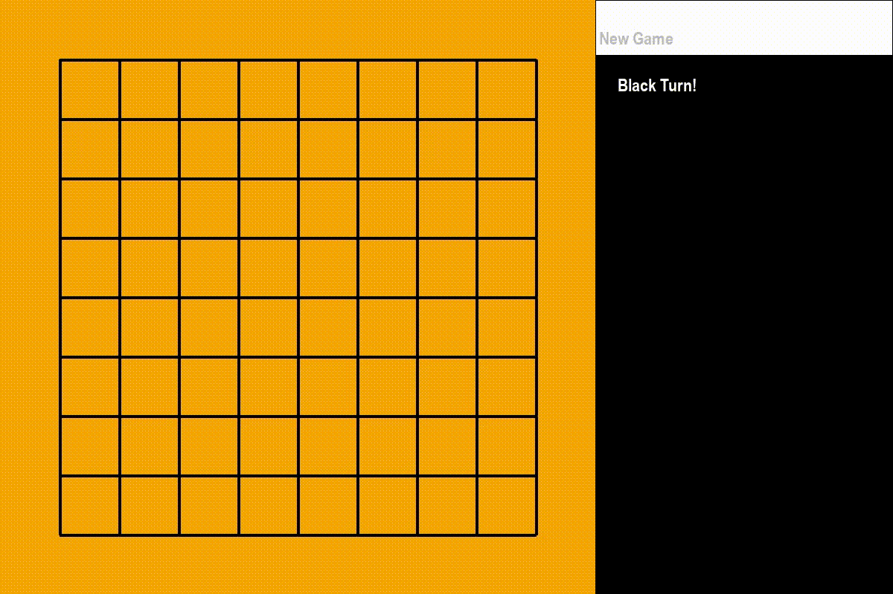

# Alpha-Zero

### Alpha zero project to play tictactoe and omok!

## How to play trained models
    python codes/play_mini_omok.py -n 1 -c

| Argument | Description |
|---|---|
| -n, --numai | number of AI agents. choose [0, 1, 2] |
| -c, --cui | play game with cui. default is gui. |
| -a, --aifirst | AI agent plays first when --numai is 1. |

## How to train models.
    python codes/train.py

train.py uses multiprocessing. If you don't have enough CUDA memory, modify **NUM_MAX_PROCESSES** in train.py.

## Future works.
Othello will be added.
## issues
Use 2 or more threads causes incomplete learning. We need to apply different threaing method or modify the parameters in agents/zero_agent.py.
